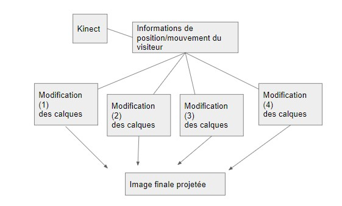

# Color your Mood

Projet réalisé en duo : trois élèves du Master 2 de Design de l'université Jean Monnet et cinq élèves-ingénieurs de
Télécom Saint-Etienne pour l'inauguration du Centre des Savoir pour l'Innovation (CSI) de Saint-Etienne.

# Matériel

- Caméra
- NUC Intel ou Raspberry Pi
- Rétro-Projecteur

# Sommaire 

- [Color your Mood](#color-your-mood)
- [Matériel](#matériel)
- [Sommaire](#sommaire)
- [Objectif](#objectif)
- [Lancement](#lancement)
- [Calibrage](#calibrage)
- [Dépendances Python :](#dépendances-python-)
  - [Installer les Dépendances](#installer-les-dépendances)
- [Contributeurs:](#contributeurs)
  - [Télécom Saint Etienne :](#télécom-saint-etienne-)
  - [Master 2 Design :](#master-2-design-)

# Objectif

L'utilisateur se présente devant la caméra, interagit avec celle-ci (suivre les instructions projetées). A l'écran va se
former un dessin représentatif de la manière dont va se comporter l'utilisateur. Si jamais l'utilisateur bouge peu
durant l'expérience, peut de choses vont apparaître à l'écran. Au contraire, si l'utilisateur est agité, l'écran va vite
se remplir et se saturer.

Pour cela, voici trois shematisation du projet 

Schema du principe

Schema de la mecanique

Schema principe programme

# Lancement 
Puisque cette oeuvre est destinee a etre expose dans un endroit passant, un ecran de veille a ete mis en place pour economiser des ressources. 
C'est pourquoi l'utilisateur doit obstruer la camera pour commencer l'experience (sans la toucher)

# Calibrage

Apres le compte a rebours, pour que la personne puisse se placer entre les rectagles, l'experience commence... 

Au niveau du developpement, la personne doit agiter ses mains dans les deux rectangles presents sur le retour video. En phase de developpement on pouvait donc voir l'emplacement des centres des bras de telle maniere.

Pour pouvoir au mieux representer le fort interieur des utilisateurs, les etudiants en design ont prepares des calques, tries de ceux representant une force tranquille jusqu'a ceux representant des forts interieurs agites.

Grace a cela, nous avons pu construire un algorithme base sur la vitesse des mains de la personne et sur la direction dans laquelle va les mains. Cela permet d'avoir un a priori convenable sur l'etat d'esprit de la personne.

A intervalle de temps regulier, on calcule alors le score de la personne, on lui associe un calque. Ensuite on calcule l'emplacement, le ratio et l'orientation du calque puis on le superpose a l'oeuvre.

Voici une illustration du choix des seuils.
Ils sont choisit automatiquement en fonction du nombre de calques.
Pour une dizaine de calques, on a :

Exemple de calques :

Un exemple de superposition de calques.

Un QR code permet de recuperer son oeuvre. Il suffit le scanner, de l'enregistrer ou de simplement retenir le numero a six chiffres dedans pour recuperer l'image sur le [site internet suivant](https://biennale.netlify.app/).

Voici un exemple de QR code qui se trouve a l'acceuil du stand.

Voici une video d'une mise en application.

# Dépendances Python :

- argparse
- collections
- imutils
- math
- numpy
- opencv-python (cv2)
- os
- screeninfo
- sys
- pygame
- pyrebase4
- time
- multiprocessing

## Installer les Dépendances
S'assurer que python3 et pip sont installés.
Ouvrir un terminal et écrire:
    python3 -m pip install -r requirements.txt

# Contributeurs:

## Télécom Saint Etienne : 

- ALEB Adam
- DEGRANGE Alexis
- RAYNAL Julien
- BIRON Gregoire
- LACLAVERIE Pierre 

## Master 2 Design :
- MAHDI Ines
- SAHRAOUI Nassima 
- TAMARZIST Syrine
